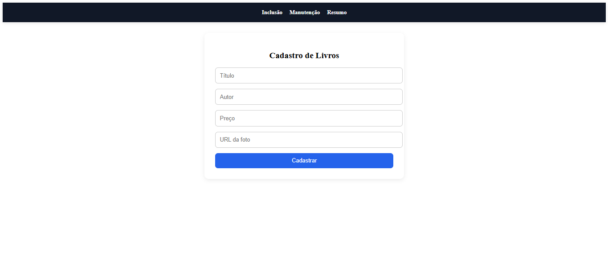
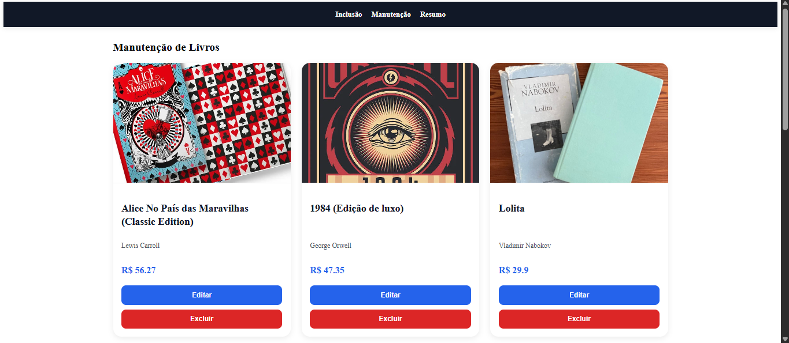
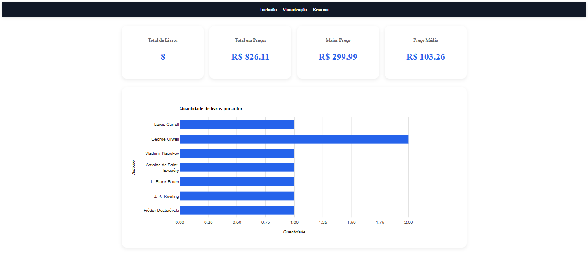

# CRUD de Livros

Sistema full stack para gerenciamento de livros desenvolvido com React, Node.js, Express, Knex e MySQL.

---

# Tecnologias Utilizadas

## Frontend
- React
- React Router DOM
- Axios
- React Hook Form
- React Google Charts

## Backend
- Node.js
- Express
- Knex
- MySQL

---

# Funcionalidades

- Cadastro de livros
- Edição completa de livros
- Exclusão de livros
- Dashboard administrativo
- Estatísticas automáticas
- Gráfico de livros por autor
- Interface responsiva
- Integração com banco de dados MySQL

---

# Estrutura do Projeto

```txt
ProjetoCompleto/
│
├── backend/
│   ├── migrations/
│   ├── seeds/
│   ├── routes/
│   ├── knexfile.js
│   ├── package.json
│   └── server.js
│
├── frontend/
│   ├── public/
│   ├── src/
│   │   ├── components/
│   │   ├── App.js
│   │   └── index.js
│   │
│   └── package.json
│
└── README.md
```

---

# Instalação

## 1. Clonar o repositório

```bash
git clone https://github.com/FernandaMarques07/crud-livros-react-node
```

---

# Configuração do Banco de Dados

## Criar banco MySQL

Abra o MySQL Workbench e execute:

```sql
CREATE DATABASE biblioteca;
```

---

# Configuração do Backend

## Entrar na pasta backend

```bash
cd backend
```

## Instalar dependências

```bash
npm install
```

## Rodar migrations

```bash
npx knex migrate:latest
```

## Rodar seeds

```bash
npx knex seed:run
```

## Iniciar servidor

```bash
npm run dev
```

Servidor backend:

```txt
http://localhost:3001
```

---

# Configuração do Frontend

## Entrar na pasta frontend

```bash
cd frontend
```

## Instalar dependências

```bash
npm install
```

## Iniciar aplicação React

```bash
npm start
```

Frontend:

```txt
http://localhost:3000
```

---

# Dashboard

O sistema possui:

- Total de livros
- Soma dos preços
- Maior preço cadastrado
- Preço médio
- Gráfico por autor

---

# API REST

## Rotas disponíveis

### Listar livros

```http
GET /livros
```

### Inserir livro

```http
POST /livros
```

### Alterar livro

```http
PUT /livros/:id
```

### Excluir livro

```http
DELETE /livros/:id
```

### Estatísticas

```http
GET /livros/resumo/geral
```

---

# Interface

- Cards responsivos
- Dashboard moderno
- Efeitos hover
- Layout administrativo
- Componentização React

---
# Screenshots

## Tela de Cadastro



---

## Tela de Manutenção



---

## Dashboard



---
# Autor

Fernanda Marques
